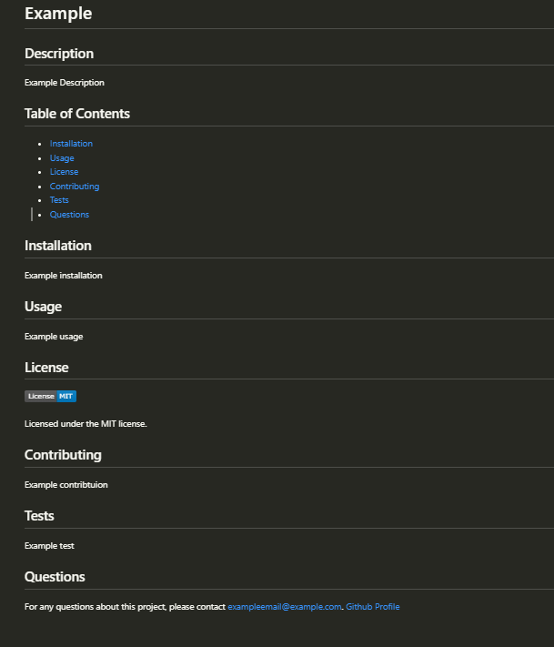

# Readme Generator App

## Description

This application allows users to create a README file. The technologies used were:

- Inquirer
- Nodejs
- JavaScript
  The main challenge faced during this challenge was creating the generateMarkDown function to write the whole readMe file when taking in the answered prompts.

## Installation

To install this application you will have to download the repository from github and runit locally from your CLI. To be able to use this project nodejs will have to be installed, this project was created using nodejs v16.20.1 which can be found [here](https://nodejs.org/en/blog/release/v16.20.1).
The dependencies for this project is Inquirer at version 8.2.4, installation instruction can be found [here](https://www.npmjs.com/package/inquirer/v/8.2.4).

## Usage

Once installed you can use the application by entering the repository location using your CLI. Once entered into the repository you can run the application by entering node .\index.js in the CLI.
Once run a series of prompts will be shown in the CLI. Once all the prompts have been answered a readme file will be produced with all the information that the user inputted to answer the prompts.
A video instruction of how to run the application can be found here:
<video src="images/Recording%202023-07-23%20173908.mp4" controls title="Title"></video>

This will produce a readme file in the readmefiles folder as shown here:

